# data-viz-ggplot
A tutorial experimenting with different options of tidyverse's ggplot.

Data Visualization using ggplot
================
Data Vizard : Madhavi
2/2/2019

You can use visual encodings like color, shape, size and alpha to encode a third variable. The choice of encodings depends on whether the third variable is continuous or discrete. For example, If there is an inherent order in the variable, one can use size to visually encode it.

``` r
ggplot(data = iris) + geom_point(mapping = aes(x = Sepal.Length , y = Petal.Length , color = Species))
```

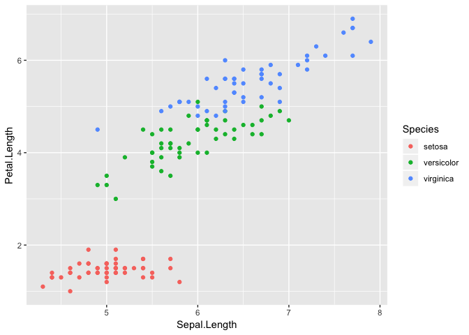

To change the aesthetic look of the map and not necessarily the mapping, mention it outside the aes attribute.

``` r
ggplot(data = iris) + geom_point(mapping = aes(x = Sepal.Length , y = Petal.Length) , color = "blue")
```

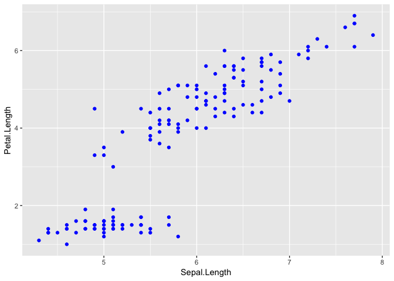

As mentioned earlier, with continuous variables, the mappings behave differently Color is encoded as a continuous shade color range and size becomes an invalid visual encoder.

``` r
ggplot(data = iris) + geom_point(mapping = aes(x = Sepal.Length , y = Petal.Length , color = Sepal.Width))
```

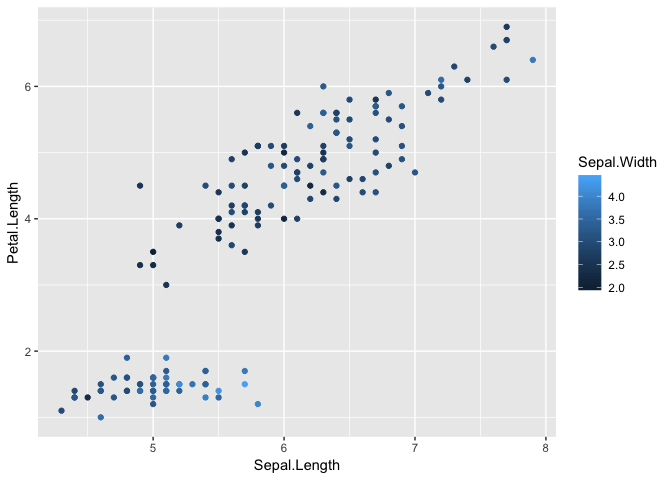

You can also provide a logical expression in the color attribute to map the points getting evaluated to different values of the expression to different colors.

``` r
ggplot(data = iris) + geom_point(mapping = aes(x = Sepal.Length , y = Petal.Length , color = Sepal.Width > 3))
```

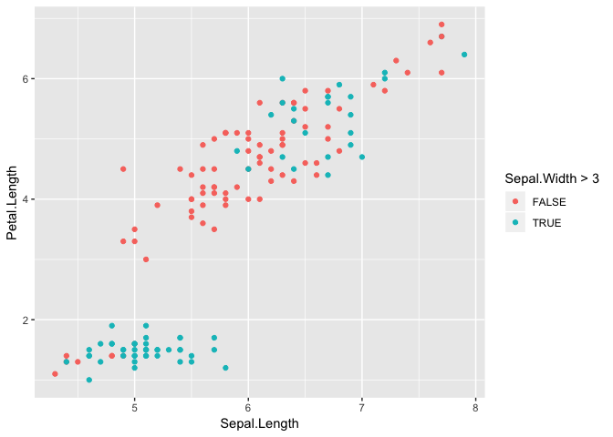

If you feel adventurous and map the same variable to two different visual encodings, you get a mapping which combines the two.

``` r
ggplot(data = iris) + geom_point(mapping =  aes(x =Sepal.Length , y = Petal.Length , color  =  Sepal.Width, size = Sepal.Width))
```

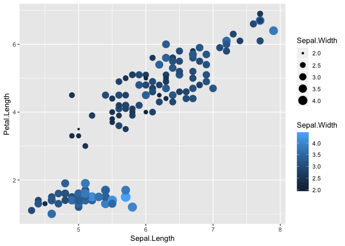

Small multiples can be created to show the same graph for diffferent subsets of data. For example, If I want to see how the city miles per gallon has changed with engine displacement across different types of drive ( front wheel , rear wheel etc), and also compare them, small multiples is the best way to see that.

``` r
ggplot(data = mpg) + geom_point(mapping = aes(x = displ , y = cty , color=class)) + facet_wrap(~drv)
```

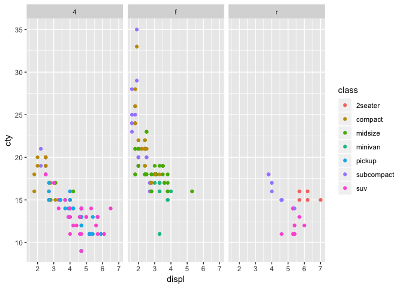

``` r
ggplot(data = mpg) + geom_point(mapping = aes(x = displ , y = cty , color=class)) + facet_grid(fl~drv)
```

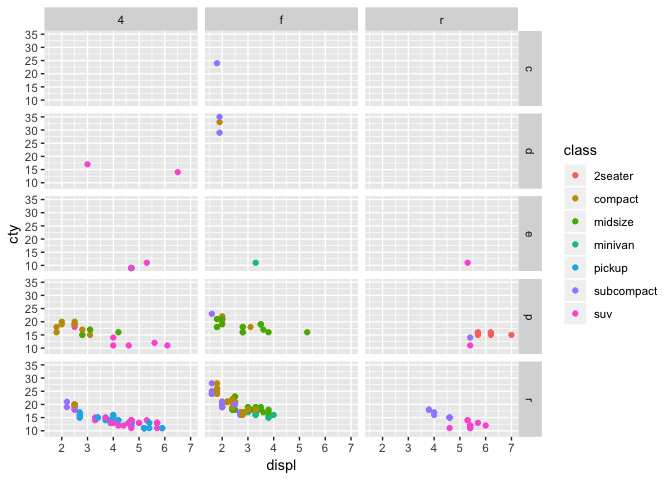

You can use different geoms based on what you want to show to the user, a line chart, a bar graph or a dot plot. For a smooth line one can use the geom\_smooth.

``` r
ggplot(data=mpg) + geom_smooth(mapping  = aes(x = displ , y = cty ,linetype = drv , color = drv))
```

    ## `geom_smooth()` using method = 'loess' and formula 'y ~ x'

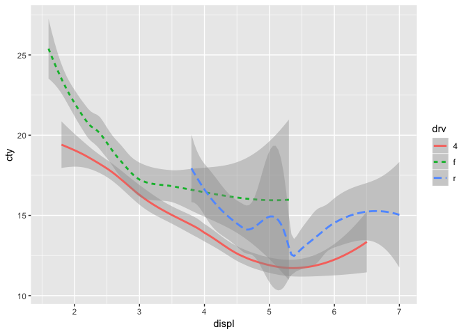

Aesthetic mappings and data that will be used in common for each geom layer can be specified as a universal property. This encourages code extensibility as you need to make changes only at one place

``` r
ggplot(data = iris , mapping = aes(x = Sepal.Length , y = Petal.Length , color = Species)) + 
  geom_point() +
  geom_smooth()
```

    ## `geom_smooth()` using method = 'loess' and formula 'y ~ x'

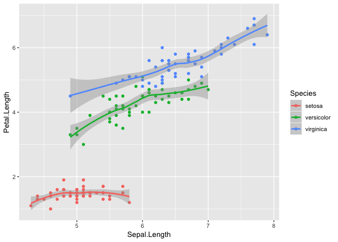

To override properties for a specific layer, override it in that specific geom function.

``` r
ggplot(data = iris , mapping = aes(x = Sepal.Length , y = Petal.Length)) + 
  geom_point(aes(color = Species)) +
  geom_smooth(data = filter(iris , Species == 'setosa') , aes())
```

    ## `geom_smooth()` using method = 'loess' and formula 'y ~ x'

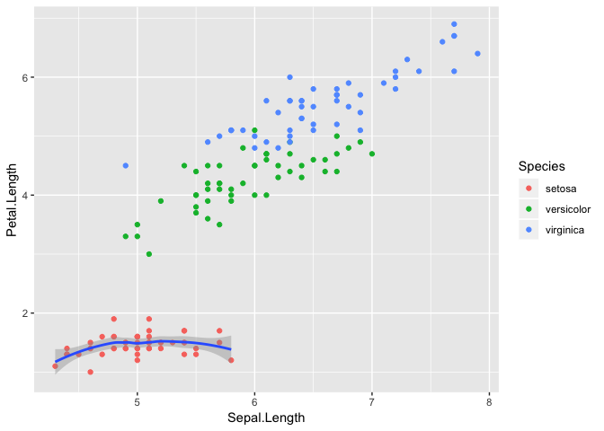

``` r
ggplot(data=mpg , mapping=aes(x = displ , y = hwy)) +
  geom_point() +
  geom_smooth(mapping = aes(group = drv))
```

    ## `geom_smooth()` using method = 'loess' and formula 'y ~ x'

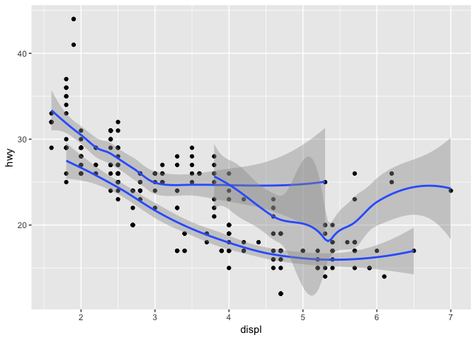

``` r
ggplot(data = mpg , mapping =aes(x=displ , y=hwy , color=drv)) +
  geom_point() +
  geom_smooth()
```

    ## `geom_smooth()` using method = 'loess' and formula 'y ~ x'

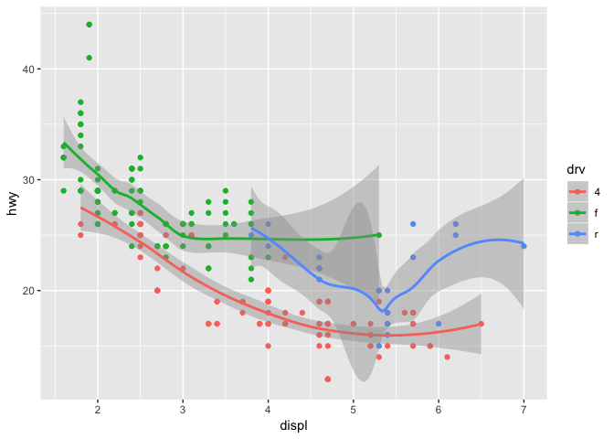

``` r
ggplot(data = mpg , mapping =aes(x=displ , y=hwy)) +
  geom_point(mapping = aes(color=drv)) +
  geom_smooth()
```

    ## `geom_smooth()` using method = 'loess' and formula 'y ~ x'

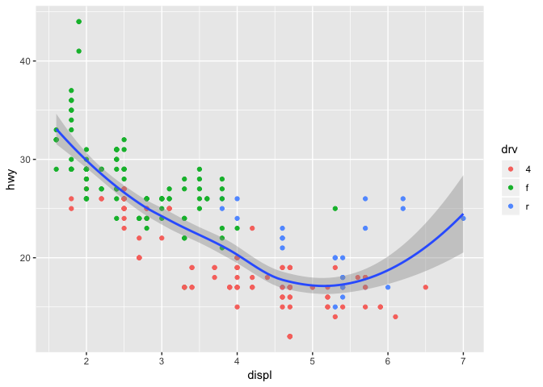

``` r
ggplot(data = mpg , mapping =aes(x=displ , y=hwy)) +
  geom_point(mapping = aes(color=drv)) +
  geom_smooth(mapping = aes(linetype=drv))
```

    ## `geom_smooth()` using method = 'loess' and formula 'y ~ x'

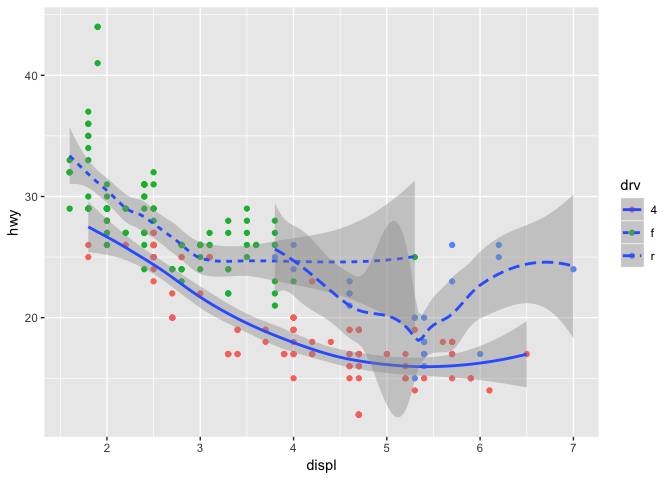

For bar charts, one can use the geom\_bar function. By default, it shows a stacked barplot, if you want to show the stacked bars as full then change position=fill and to show a grouped barplot, one can use position=dodge

``` r
ggplot(data=mpg) +
  geom_bar(mapping = aes(x=class , fill=fl))
```

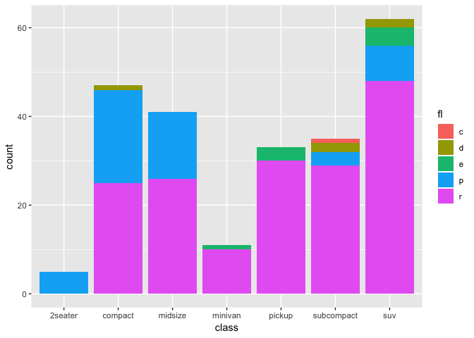

``` r
ggplot(data=mpg) +
  geom_bar(mapping = aes(x = class , fill = fl), position="fill")
```

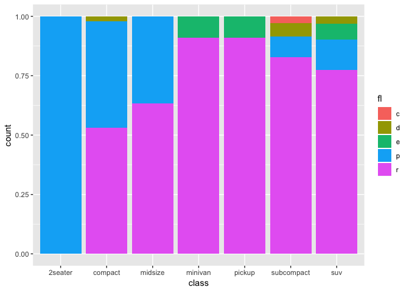

``` r
ggplot(data=mpg) +
  stat_count(mapping = aes(x = class , fill = fl), position="dodge")
```

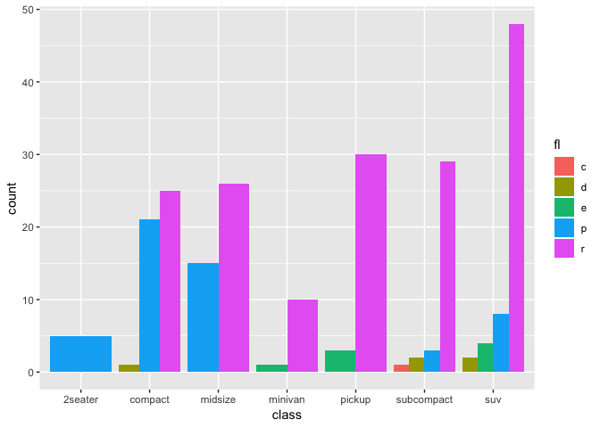

Similarly, Boxplot using geom\_boxplot.

``` r
ggplot(data = iris) +
  geom_boxplot(mapping = aes(x = Species , y = Petal.Length ), outlier.colour="red") + 
  coord_flip()
```

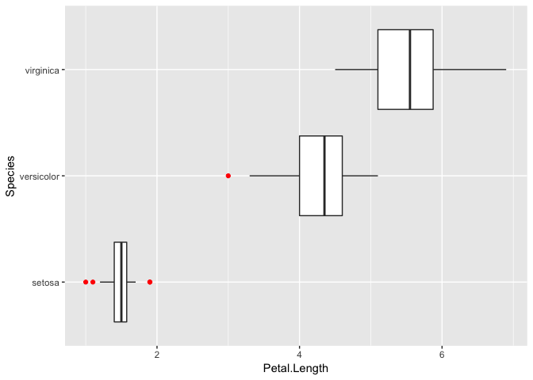
